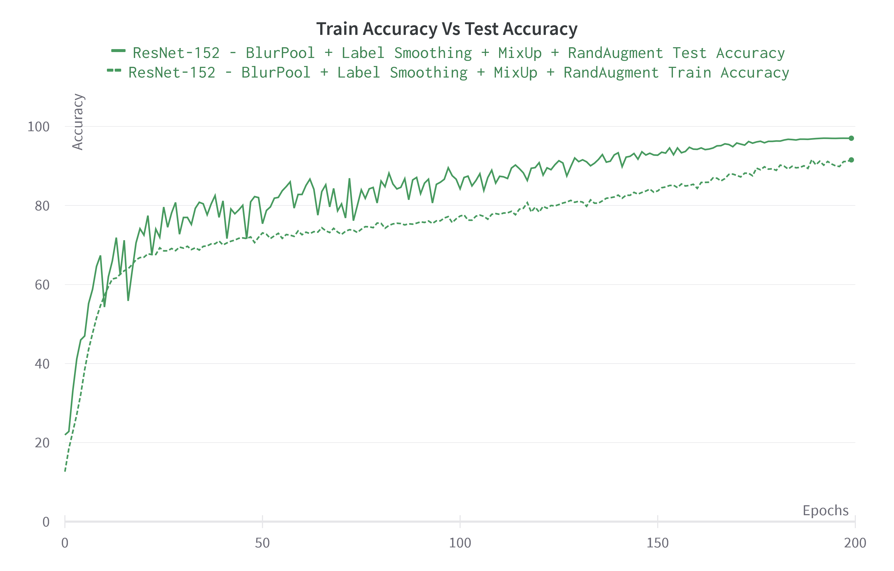

# PyTorch ResNet-152: Mastering Model Training with MosaicML [Composer](https://www.mosaicml.com/composer) and [Weights & Biases](https://wandb.ai/)

# **Welcome**

Composer is an open-source deep learning training library by [MosaicML](https://www.mosaicml.com/). Built on top of PyTorch, the Composer library makes it easier to implement distributed training workflows on large-scale clusters.

I have implemented a slightly modified ResNet-152 model on the CIFAR-10 dataset, which achieved an accuracy of 97.02% after training for 200 epochs. However, I made some improvements by incorporating three additional composer library functions, and this enhanced ResNet-152 model achieved a higher accuracy. Notably, these improvements helped in saving both computation time and overall training time.

Four functions I used in the training of the model.
1. RandAugment
2. BlurPool
3. Label Smoothing
4. MixUp

**1. RandAugment:**

   RandAugment applies random depth image augmentations sequentially from a set of augmentations (e.g. translation, shear, contrast) with severity values randomly selected from 0 to 10. This regularization method during training enhances network generalization.
<!--pytest.mark.filterwarnings(r'ignore:Some targets have less than 1 total probability:UserWarning')-->
<!--pytest.mark.filterwarnings('ignore:Cannot split tensor of length .* into batches of size 128.*:UserWarning')-->
```python
randaugment_transform = RandAugmentTransform(severity=9,
                                             depth=2,
                                             augmentation_set="all")
transform_train_data = transforms.Compose([
    randaugment_transform,
    ........,
])
```

**2. BlurPool:**

BlurPool enhances the accuracy of convolutional neural networks without significantly slowing them down. It achieves this by using a low-pass filter before pooling and strided convolution operations, which helps reduce distortion (aliasing) in the processed images.
<!--pytest.mark.filterwarnings(r'ignore:Some targets have less than 1 total probability:UserWarning')-->
<!--pytest.mark.filterwarnings('ignore:Cannot split tensor of length .* into batches of size 128.*:UserWarning')-->
```python
# Model
print('-- ResNet-152 --')
net = ResNet152()
#--- Composer BlurPool ---#
CF.apply_blurpool(
        net,
        optimizers=optimizer,
        replace_convs=True,
        replace_maxpools=True,
        blur_first=True
    )
net = net.to(device)
```

**3. MixUp:**

The following paragraph I copied from [the bag of tricks](https://arxiv.org/abs/1812.01187) paper. 
"Here we consider another augmentation method called mixup. In mixup, each time we randomly sample two examples (xi, yi) and (xj , yj ). Then we form a new example by a weighted linear interpolation of these two examples:
x-hat = λxi + (1 − λ)xj
y-hat = λyi + (1 − λ)yj 
where λ ∈ [0, 1] is a random number drawn from the Beta(α, α) distribution. In mixup training, we only use the new example (x-hat, y-hat)."
<!--pytest.mark.filterwarnings(r'ignore:Some targets have less than 1 total probability:UserWarning')-->
<!--pytest.mark.filterwarnings('ignore:Cannot split tensor of length .* into batches of size 128.*:UserWarning')-->
```python
# -- Composer MixUp Batch Data -- 
        X_mixed, y_perm, mixing = CF.mixup_batch(inputs, targets, alpha=0.2)
        outputs = net(X_mixed)
```

**4. Label Smoothing:**

It is proposed by Christian Szegedy in [this](https://arxiv.org/abs/1512.00567) paper. It actually acts as a regularizer technique. The composer makes this function very easy to use.
<!--pytest.mark.filterwarnings(r'ignore:Some targets have less than 1 total probability:UserWarning')-->
<!--pytest.mark.filterwarnings('ignore:Cannot split tensor of length .* into batches of size 128.*:UserWarning')-->
```python
# -- Composer Label Smoothing --
         smoothed_targets = CF.smooth_labels(outputs, targets, smoothing=0.1)
```
*Note*: Because of MixUp and Label Smoothing, sample (x) and label (y) values change, therefore, the loss is calculated as follows:
<!--pytest.mark.filterwarnings(r'ignore:Some targets have less than 1 total probability:UserWarning')-->
<!--pytest.mark.filterwarnings('ignore:Cannot split tensor of length .* into batches of size 128.*:UserWarning')-->
```python
loss = (1 - mixing) * criterion(outputs, smoothed_targets) + mixing * criterion(outputs, y_perm)
```

*Note*: These techniques make the training of a model harder. That is why, the accuracy of training data is lower than the accuracy of test data. 



### Follow the following steps to run the code

1. Install Weights & Biases
   
    ```%pip install wandb -q```  
2. Install PyTorch Model Summary Library for getting layer by layer summary of a model

    ```pip install pytorch-model-summary```
3. Install PTFLOPS for counting floating point operations

    ```pip install ptflops```
4. Login to your WandB account so you can log all your metrics

    ```import wandb```
   
    ```wandb.login()```
5. Initialize a new run and specify your project name on WandB

    ```wandb.init(project="[YOUR_PROJECT_NAME]")```
6. Install Composer Library

   ```!pip install mosaicml```
7. Execute the [main.py](https://github.com/abdulsam/Better_Fatser_Models_with_Composer/blob/main/main.py) file.
